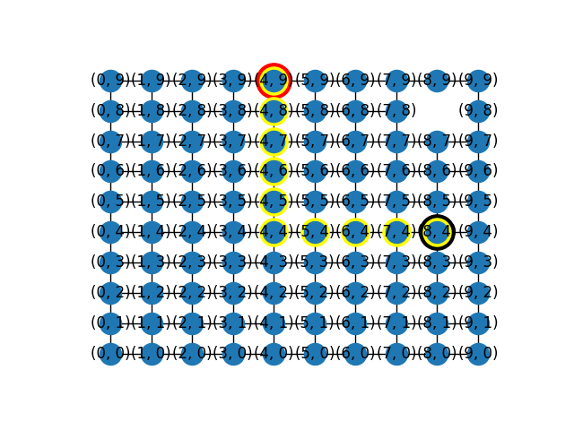

# RouteOptimo

Este é um script Python que utiliza a biblioteca NetworkX e Matplotlib para visualizar a execução de um algoritmo de busca de caminho mais curto em um grafo bidimensional. O algoritmo de Dijkstra é usado para encontrar o caminho mais curto entre dois pontos no grafo.

## Pré-requisitos
Certifique-se de ter o Python instalado em seu sistema, juntamente com as seguintes bibliotecas:

- NetworkX
- Matplotlib
- PIL (Pillow)

###
Você pode instalar as bibliotecas necessárias usando o seguinte comando:

```bash
pip install networkx matplotlib pillow
```

### Como Executar
Cole o código fornecido em um arquivo Python (por exemplo, `shortest_path_visualization.py`).

Execute o script usando o Python:

```bash
python shortest_path_visualization.py
```

## Descrição
Este script gera um grafo bidimensional usando a biblioteca NetworkX. O objetivo é demonstrar visualmente o processo de encontrar o caminho mais curto entre um ponto de origem (Robô) e um ponto de destino (PC). O algoritmo de Dijkstra é utilizado para encontrar o caminho mais curto.

O grafo é exibido em uma janela usando a biblioteca Matplotlib. Cada etapa da execução é ilustrada, mostrando o movimento do Robô em direção ao PC, bem como os nós que fazem parte do caminho mais curto.

## Saída
O script exibirá uma série de imagens à medida que o algoritmo avança etapa por etapa. Cada imagem mostra o progresso do Robô em direção ao PC, destacando o caminho mais curto.

O caminho mais curto e a distância total percorrida pelo Robô serão exibidos no console.



## Observações
Este script é destinado a fins de visualização e demonstração. Ele usa uma representação simplificada de um algoritmo de busca de caminho mais curto. Lembre-se de que a implementação e a exibição do algoritmo podem variar dependendo das condições específicas do problema e das bibliotecas utilizadas.
